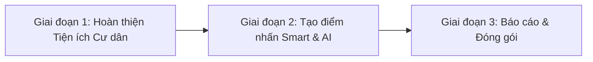

# BÁO CÁO ĐÁNH GIÁ TỔNG QUAN DỰ ÁN & ĐỐI CHIẾU 19 MODULE QUẢN LÝ CHUNG CƯ THÔNG MINH

> **Tên đề tài**: Hệ thống Quản lý Chung cư Thông minh (Smart Apartment Management System)  
> **Thời điểm đánh giá**: Tháng 09/2026  
> **Kiến trúc mã nguồn**: Next.js App Router, TypeScript, PostgreSQL, Prisma ORM, NextAuth.js, TanStack React Query, Zod, shadcn/ui  

---

## 1. TỔNG QUAN DỰ ÁN HIỆN TẠI (EXECUTIVE SUMMARY)

### 1.1. Hiện trạng Kiến trúc
Dự án hiện tại được xây dựng theo mô hình **API-first 5 lớp** rất bài bản và phân định trách nhiệm rõ ràng:
1. **Giao diện (UI)**: React Components + TailwindCSS + shadcn/ui (Radix UI) + Lucide Icons.
2. **Quản lý State Client**: TanStack React Query (Custom Hooks trong `src/hooks/use-*.ts`).
3. **Client Services**: Gọi HTTP Fetch về API Route nội bộ (`src/services/*.service.ts`).
4. **API Route Handlers**: `src/app/api/**/route.ts` (NextAuth Session Check, Zod Validation).
5. **Nghiệp vụ & Dữ liệu**: `src/modules/*/*.service.ts` kết hợp `src/modules/*/*.repository.ts` tương tác trực tiếp với Prisma ORM.

### 1.2. Đánh giá Tổng thể so với 19 Yêu cầu
- **Mức độ hoàn thiện cốt lõi**: **~55% - 60%**.
- **Điểm mạnh vượt trội**: Các luồng quản trị lõi (Core Property Management) gồm **Căn hộ, Cư dân, Hợp đồng, Hóa đơn & Thu phí tự động hàng loạt, QR Payment, Quản lý Phương tiện & Thẻ từ RFID, Phản ánh sự cố chuẩn SLA có chấm sao, Dashboard Analytics** đã được lập trình hoàn chỉnh, logic nghiệp vụ chặt chẽ, kiểm thử tự động tốt.
- **Điểm còn thiếu so với một hệ sinh thái Smart Building toàn diện**: Hệ thống chưa có các phân hệ phục vụ tiện ích cộng đồng và vận hành chuyên sâu như **Đặt tiện ích chung (Gym/BBQ/Bể bơi), Quản lý khách vãng lai (Visitor QR), Quản lý giao nhận hàng (Parcel), Biểu quyết cư dân (Polls), Quản lý thiết bị bảo trì định kỳ (Preventive Maintenance), Cảm biến IoT và Trợ lý ảo AI**.

---

## 2. MA TRẬN ĐỐI CHIẾU 19 HẠNG MỤC (GAP ANALYSIS MATRIX)

| STT | Phân hệ / Tính năng yêu cầu | Trạng thái hiện tại | Mức độ đáp ứng | Đánh giá chênh lệch |
|:---:|---|:---:|:---:|---|
| **0** | **3 Nhóm người dùng (BQL, Kỹ thuật/Bảo vệ, Cư dân)** | 🟡 Có một phần | 65% | Đã phân tách BQL (`ADMIN`, `MANAGER`) và `RESIDENT`. Chưa tách riêng Role cho Bảo vệ, Kỹ thuật viên, Lễ tân. |
| **1** | **Quản lý Tòa nhà, Block, Tầng, Căn hộ, Trạng thái** | 🟢 Đã hoàn thiện | 85% | Có CRUD Căn hộ, Tầng, Tòa, Diện tích, Trạng thái, Hợp đồng. Chưa có mô hình cây đồ họa Block ➔ Tầng ➔ Căn và lịch sử chủ hộ riêng biệt. |
| **2** | **Quản lý Cư dân & Hộ gia đình** | 🟢 Đã hoàn thiện | 85% | Có CCCD, SĐT, quan hệ chủ hộ, liên kết căn hộ, trạng thái ở. Chưa có module khai báo tạm trú / khách ở dài ngày chuyên dụng. |
| **3** | **Quản lý Phí, Hóa đơn & Cổng thanh toán Online** | 🟢 Đã hoàn thiện | 95% | Có cấu hình biểu phí, tự động sinh hóa đơn hàng loạt theo tháng, QR Banking, VNPay/MoMo Sandbox, biên lai PDF. |
| **4** | **Quản lý Phương tiện & Thẻ gửi xe RFID** | 🟢 Đã hoàn thiện | 80% | Quản lý biển số, loại xe, duyệt cavet xe, cấp/khóa thẻ từ RFID. Chưa có bảng ghi lịch sử quẹt thẻ ra/vào barrier. |
| **5** | **Quản lý Sự cố & Yêu cầu dịch vụ (SLA)** | 🟢 Đã hoàn thiện | 95% | Quy trình Ticket chuẩn SLA, tiếp nhận, phân công kỹ thuật, cập nhật tiến độ, ảnh đính kèm, trao đổi bình luận, đánh giá 1-5 sao. |
| **6** | **Quản lý Thiết bị Chung & Bảo trì Định kỳ** | 🟡 Có một phần | 35% | Các sự cố thiết bị được xử lý qua Ticket `Feedback`. Chưa có bảng quản lý danh mục Thiết bị (Asset) và lịch nhắc bảo trì định kỳ tự động. |
| **7** | **Hệ thống Thông báo Tòa nhà** | 🟢 Đã hoàn thiện | 80% | BQL tạo thông báo, gửi toàn tòa hoặc theo căn hộ. Cư dân có hộp thư và đánh dấu đã đọc. Chưa có bộ lọc đa tầng (Block ➔ Tầng ➔ Căn). |
| **8** | **Đặt Tiện ích Chung (Gym, Hồ bơi, BBQ...)** | 🔴 Chưa có | 0% | Chưa có cơ sở dữ liệu và giao diện đặt lịch kiểm tra slot trống. |
| **9** | **Quản lý Nhân sự & Phân quyền Chi tiết** | 🟡 Có một phần | 40% | Đã có tài khoản BQL và gán nhân viên xử lý sự cố. Chưa có màn hình quản lý hồ sơ nhân viên và ma trận phân quyền chi tiết. |
| **10** | **Quản lý Khách Vãng lai & QR Check-in** | 🔴 Chưa có | 0% | Cư dân chưa có chức năng tạo mã QR cho khách; bảo vệ chưa có màn hình quét check-in. |
| **11** | **Quản lý Giao nhận Bưu kiện (Parcel)** | 🔴 Chưa có | 0% | Lễ tân chưa có chức năng nhận bưu phẩm hộ shipper và thông báo mã nhận hàng cho cư dân. |
| **12** | **Khảo sát & Biểu quyết Cư dân (Polls/Voting)** | 🔴 Chưa có | 0% | Chưa có tính năng tạo thăm dò ý kiến và tính tỷ lệ biểu quyết đồng thuận. |
| **13** | **Dashboard Vận hành & Phân tích Dữ liệu** | 🟢 Đã hoàn thiện | 95% | Bảng điều khiển cực kỳ chi tiết: KPI số động, biểu đồ Doanh thu 6/12 tháng, tỷ lệ lấp đầy, phân bổ sự cố, bãi xe, Smart Alerts. |
| **14** | **Xác thực & Phân quyền (Auth & RBAC)** | 🟢 Đã hoàn thiện | 85% | NextAuth JWT, Middleware bảo vệ route BQL vs Cư dân, đăng nhập tự động 1-click. Chưa có OTP SMS / Google OAuth. |
| **15** | **Notification Center Real-time** | 🟡 Có một phần | 50% | Có lưu Database, Smart Alerts, chuông thông báo. Chưa có WebSocket / SSE đẩy tin nổi (toast) tức thì. |
| **16** | **Phần "Smart" Operations / IoT** | 🟡 Có một phần | 50% | Đã có `SmartAlertService` và `SmartInsightService` quét thông minh dữ liệu DB phát hiện vi phạm SLA, quá hạn. Chưa có cảm biến IoT phần cứng. |
| **17** | **Trí tuệ Nhân tạo (AI Assistant)** | 🔴 Chưa có | 0% | Chưa tích hợp AI Chatbot tra cứu thông tin hoặc AI tự phân loại mức độ khẩn cấp của sự cố. |
| **18** | **Quản lý Tài chính Chuyên sâu (P&L)** | 🟡 Có một phần | 60% | Đã quản lý trọn vẹn doanh thu thu từ căn hộ, công nợ. Chưa có quản lý Chi phí vận hành (OPEX) để tính dòng tiền thực. |
| **19** | **Trung tâm Báo cáo & Xuất file** | 🟡 Có một phần | 50% | Đã xuất biên lai PDF bằng `jspdf`. Chưa có màn hình tổng hợp xuất báo cáo Excel/CSV đa chiều. |

---

## 3. PHÂN TÍCH CHI TIẾT TỪNG PHẦN & HƯỚNG DẪN SỬA ĐỔI CHUẨN XÁC

---

### Nhóm Người Dùng & Phân Quyền (Mục 0, 9 & 14)

#### Hiện trạng
- Trong `prisma/schema.prisma`, enum `Role` mới chỉ có 3 giá trị: `ADMIN`, `MANAGER`, `RESIDENT`.
- Giao diện được tách làm 2 nhóm: `(management)` (dành cho Admin, Manager) và `(resident)` (dành cho Cư dân).
- Chưa có vai trò rõ ràng cho nhân viên cấp dưới: Bảo vệ (Security), Kỹ thuật viên (Technician), Lễ tân (Receptionist).

#### Cách sửa chuẩn xác
1. **Cập nhật Database**:
   ```prisma
   enum Role {
     ADMIN
     MANAGER
     STAFF_TECHNICIAN
     STAFF_SECURITY
     STAFF_RECEPTIONIST
     RESIDENT
   }
   ```
2. **Cập nhật Middleware (`src/middleware.ts`)**:
   - `STAFF_TECHNICIAN`: Chỉ truy cập được `/feedbacks` và cập nhật tiến độ xử lý kỹ thuật.
   - `STAFF_SECURITY`: Chỉ truy cập được `/vehicles`, `/parking-cards` và trang quét QR khách.
   - `STAFF_RECEPTIONIST`: Chỉ truy cập được `/parcels` (bưu kiện) và danh sách cư dân.
3. **Thêm màn hình Quản lý Nhân sự** (`src/app/(management)/staff/page.tsx`):
   - Danh sách nhân viên, gán ca trực, phân quyền theo chức vụ.

---

### Module 1: Quản lý Tòa nhà & Căn hộ (Mục 1)

#### Hiện trạng
- Đã có model `Apartment` (`code`, `building`, `floor`, `bedrooms`, `bathrooms`, `area`, `status`, `note`).
- Đã có model `Contract` quản lý hợp đồng thuê/bán và cảnh báo hết hạn.
- Đã có trang `(management)/apartments` dạng bảng danh sách (Table view) và bộ lọc.

#### Điểm khác biệt & Thiếu sót
- Chưa có mô hình trực quan dạng cây (Block ➔ Tầng ➔ Căn) giúp BQL nhìn bao quát mặt bằng toàn tòa nhà.
- Chưa có bảng lưu vết lịch sử biến động chủ hộ/cư dân khi căn hộ đổi chủ (`ApartmentOwnershipHistory`).

#### Cách sửa chuẩn xác
1. **Thêm Model Lịch sử Biến động Căn hộ**:
   ```prisma
   model ApartmentHistory {
     id          String   @id @default(cuid())
     apartmentId String
     apartment   Apartment @relation(fields: [apartmentId], references: [id], onDelete: Cascade)
     eventType   String   // "OWNER_TRANSFER", "TENANT_MOVE_IN", "STATUS_CHANGE"
     oldValue    String?
     newValue    String
     note        String?
     createdAt   DateTime @default(now())
   }
   ```
2. **Bổ sung Giao diện Mặt bằng Căn hộ trực quan (Floor Plan Grid)**:
   - Thêm tab chuyển đổi giữa "Dạng bảng" và "Dạng sơ đồ mặt bằng".
   - Mỗi tầng hiển thị một hàng các ô căn hộ; màu ô thể hiện trạng thái (Xanh lá: Đang ở, Xám: Trống, Vàng: Sửa chữa).

---

### Module 2: Quản lý Cư dân & Hộ gia đình (Mục 2)

#### Hiện trạng
- Đã có model `Resident` với đầy đủ: `identityCard` (CCCD), `phone`, `email`, `relationshipToOwner` (`OWNER`, `FAMILY`, `TENANT`), `status` (`RESIDING`, `MOVED_OUT`, `TEMPORARY_ABSENT`).
- Đã có liên kết giữa tài khoản User và hồ sơ Cư dân.

#### Điểm khác biệt & Thiếu sót
- Chưa có chức năng đăng ký Khách ở dài ngày / Khai báo tạm vắng trực tuyến nộp cho BQL duyệt.
- Chưa hiển thị giao diện phân nhóm thành Hộ gia đình (Household view).

#### Cách sửa chuẩn xác
1. **Cập nhật UI Căn hộ & Cư dân**:
   - Trên chi tiết Căn hộ, hiển thị danh sách dạng cây: **Chủ hộ** ở trên cùng ➔ Danh sách **Thành viên gia đình** / **Khách thuê** ở bên dưới.
2. **Thêm Form Cư dân Đăng ký Tạm trú / Khách ở tạm**:
   - Cư dân gửi form khai báo thông tin khách (Họ tên, CCCD, thời gian tạm trú từ ngày ... đến ngày ...).
   - BQL nhận thông báo và bấm nút "Xác nhận tiếp nhận thông tin lưu trú".

---

### Module 3: Quản lý Biểu phí & Thanh toán Online (Mục 3)

#### Hiện trạng
- Rất hoàn thiện: Đã có `FeeCategory`, `Invoice`, `InvoiceItem`.
- Tự động sinh hóa đơn hàng loạt theo tháng dựa trên công thức m², số lượng xe.
- Đã có cổng thanh toán sandbox MoMo, VNPay và sinh mã VietQR thanh toán ngân hàng.

#### Cách hoàn thiện thêm
- Bổ sung cấu hình phí phạt chậm nộp quá hạn (% lãi phạt sau ngày đến hạn `dueDate`).
- Tích hợp webhook tự động đổi trạng thái hóa đơn sang `PAID` khi nhận thông báo từ ngân hàng/cổng thanh toán.

---

### Module 4: Quản lý Phương tiện & Thẻ gửi xe (Mục 4)

#### Hiện trạng
- Đã có model `Vehicle` (loại xe, biển số, giấy tờ cavet) và `ParkingCard` (mã thẻ RFID, trạng thái khóa thẻ, lý do khóa).
- Đã có chức năng BQL phê duyệt xe và cấp phát thẻ từ RFID.

#### Điểm khác biệt & Thiếu sót
- Chưa có lịch sử quẹt thẻ ra/vào barrier phục vụ kiểm tra đối soát an ninh.

#### Cách sửa chuẩn xác
1. **Thêm Model Lịch sử Ra/Vào**:
   ```prisma
   model ParkingAccessLog {
     id           String      @id @default(cuid())
     cardCode     String
     licensePlate String
     direction    String      // "IN" | "OUT"
     gateName     String      // "Cổng chính A", "Cổng hầm B"
     timestamp    DateTime    @default(now())
     isAllowed    Boolean     @default(true)
     note         String?
     
     @@index([licensePlate])
     @@index([timestamp])
   }
   ```
2. **Thêm màn hình Mô phỏng Quẹt thẻ Barrier**:
   - Tạo trang `/parking-cards/simulator` cho phép nhập mã thẻ hoặc biển số để test kiểm tra thẻ hợp lệ và ghi log ra/vào.

---

### Module 5: Quản lý Sự cố & Yêu cầu Dịch vụ SLA (Mục 5)

#### Hiện trạng
- **Rất hoàn thiện và chuẩn mực**: Có mã ticket (`FB-2026-0001`), danh mục, độ ưu tiên, hạn chót cam kết SLA (`slaDueAt`), phân công nhân viên (`assignedStaffId`), lịch sử chuyển trạng thái, comment trao đổi nội bộ/công khai và đánh giá sao (1-5 sao).

#### Cách hoàn thiện thêm
- Giữ nguyên kiến trúc hiện tại vì đây là một trong những module mạnh nhất của dự án.
- Có thể thêm nút đính kèm nhiều ảnh chụp trước và sau khi xử lý xong (Before/After photos).

---

### Module 6: Quản lý Bảo trì Thiết bị Chung (Mục 6)

#### Hiện trạng
- Hiện tại việc hỏng hóc thang máy, máy bơm, PCCC đang được xử lý chung trong bảng `Feedback`.
- **Chưa có** bảng quản lý danh mục Tài sản/Thiết bị tòa nhà (Asset) và lịch nhắc bảo trì định kỳ ngăn ngừa sự cố (Preventive Maintenance).

#### Cách sửa chuẩn xác
1. **Thêm 2 Model mới vào `prisma/schema.prisma`**:
   ```prisma
   model BuildingAsset {
     id                String   @id @default(cuid())
     code              String   @unique // "ELEVATOR-A01", "PUMP-B01"
     name              String   // "Thang máy Otis Block A"
     location          String   // "Block A - Trục 1"
     supplier          String?  // "Công ty Thang máy Otis VN"
     installDate       DateTime?
     warrantyExpiryDate DateTime?
     status            String   @default("OPERATIONAL") // OPERATIONAL, MAINTENANCE, BROKEN
     createdAt         DateTime @default(now())
     
     maintenanceSchedules AssetMaintenanceSchedule[]
   }

   model AssetMaintenanceSchedule {
     id               String        @id @default(cuid())
     assetId          String
     asset            BuildingAsset @relation(fields: [assetId], references: [id], onDelete: Cascade)
     cycleDays        Int           // Chu kỳ (ví dụ 30 ngày bảo dưỡng 1 lần)
     lastMaintenance  DateTime
     nextMaintenance  DateTime      // Ngày bảo dưỡng kế tiếp
     assignedVendor   String?
     status           String        @default("SCHEDULED") // SCHEDULED, COMPLETED, OVERDUE
     note             String?
   }
   ```
2. **Tích hợp vào `SmartAlertService`**:
   - Quét các thiết bị có `nextMaintenance` còn dưới 3 ngày để tự động hiển thị cảnh báo: *"⚠️ Thang máy A-01 còn 3 ngày nữa đến hạn bảo trì định kỳ"*.

---

### Module 7: Quản lý Thông báo Tòa nhà (Mục 7)

#### Hiện trạng
- Đã có model `Notification`, `NotificationApartment`, `NotificationRead`.
- BQL gửi thông báo toàn tòa nhà hoặc chọn đích danh căn hộ.

#### Điểm khác biệt & Thiếu sót
- Chưa có thuộc tính phân loại loại tin (Khẩn cấp, Thu phí, Bảo trì, Sự kiện).
- Chưa có bộ lọc gửi theo Block hoặc theo Tầng.

#### Cách sửa chuẩn xác
1. **Bổ sung Enum & Trường dữ liệu vào Model Notification**:
   ```prisma
   enum NotificationCategory {
     GENERAL
     EMERGENCY
     MAINTENANCE
     BILLING
     EVENT
   }
   ```
2. **Nâng cấp UI Tạo Thông báo**:
   - Thêm trường chọn danh mục thông báo (để hiển thị badge màu sắc tương ứng: Khẩn cấp màu đỏ, Bảo trì màu vàng cam).
   - Thêm lựa chọn người nhận: "Toàn bộ tòa nhà" | "Theo Block" | "Theo Tầng" | "Theo Căn hộ cụ thể".

---

### Module 8: Đặt Tiện ích Chung (Gym, Hồ bơi, BBQ...) (Mục 8)

#### Hiện trạng
- **Chưa có** trong mã nguồn hiện tại.

#### Cách bổ sung chuẩn xác
1. **Thêm Model `Facility` và `FacilityBooking` vào Prisma**:
   ```prisma
   model Facility {
     id           String   @id @default(cuid())
     name         String   // "Phòng Gym", "Hồ bơi", "Vườn nướng BBQ"
     openTime     String   // "06:00"
     closeTime    String   // "22:00"
     slotMinutes  Int      @default(60) // 60 phút mỗi ca
     maxSlotUsers Int      @default(10) // Số người tối đa trong 1 khung giờ
     isFree       Boolean  @default(true)
     hourlyFee    Float    @default(0)
     
     bookings     FacilityBooking[]
   }

   model FacilityBooking {
     id           String    @id @default(cuid())
     facilityId   String
     facility     Facility  @relation(fields: [facilityId], references: [id], onDelete: Cascade)
     apartmentId  String
     apartment    Apartment @relation(fields: [apartmentId], references: [id], onDelete: Cascade)
     bookingDate  DateTime
     startTime    String    // "18:00"
     endTime      String    // "19:00"
     userCount    Int       @default(1)
     status       String    @default("CONFIRMED") // CONFIRMED, CANCELLED
     createdAt    DateTime  @default(now())
   }
   ```
2. **Viết Service kiểm tra slot trống**:
   - Khi cư dân chọn ngày và giờ, hệ thống đếm số `userCount` đã đặt trong khung giờ đó; nếu chưa vượt quá `maxSlotUsers` thì cho phép lưu, ngược lại báo "Đã hết chỗ".
3. **Thêm UI**:
   - Cư dân: Trang `/resident/facilities` chọn tiện ích và click vào khung giờ còn trống để đặt.
   - BQL: Trang `/facilities` để quản lý danh sách tiện ích và xem lịch sử đặt chỗ.

---

### Module 10: Quản lý Khách Vãng lai & Check-in QR Code (Mục 10)

#### Hiện trạng
- **Chưa có** trong mã nguồn hiện tại.

#### Cách bổ sung chuẩn xác
1. **Thêm Model `VisitorPass`**:
   ```prisma
   model VisitorPass {
     id            String    @id @default(cuid())
     passCode      String    @unique // Mã token ngẫu nhiên sinh QR
     apartmentId   String
     apartment     Apartment @relation(fields: [apartmentId], references: [id], onDelete: Cascade)
     visitorName   String
     visitorPhone  String?
     visitDate     DateTime
     expectedTime  String    // "19:00 - 22:00"
     licensePlate  String?
     status        String    @default("PENDING") // PENDING, CHECKED_IN, CHECKED_OUT, EXPIRED
     checkInAt     DateTime?
     checkOutAt    DateTime?
     createdAt     DateTime  @default(now())
   }
   ```
2. **Luồng hoạt động**:
   - Cư dân tạo thông tin khách ➔ Hệ thống sinh mã QR dạng thẻ mời điện tử.
   - Bảo vệ dùng trang `/visitors/scan` quét camera hoặc nhập mã ➔ Hệ thống hiện thông tin khách và căn hộ mời ➔ Bấm "Xác nhận Check-in".

---

### Module 11: Quản lý Giao nhận Bưu kiện (Parcel) (Mục 11)

#### Hiện trạng
- **Chưa có** trong mã nguồn hiện tại.

#### Cách bổ sung chuẩn xác
1. **Thêm Model `ParcelDelivery`**:
   ```prisma
   model ParcelDelivery {
     id          String    @id @default(cuid())
     apartmentId String
     apartment   Apartment @relation(fields: [apartmentId], references: [id], onDelete: Cascade)
     carrier     String    // "Shopee Express", "Giao Hàng Nhanh", "Viettel Post"
     trackingNum String?
     pickupCode  String    // Mã 6 số ngẫu nhiên để cư dân đọc khi lấy hàng
     photoUrl    String?
     status      String    @default("RECEIVED") // RECEIVED (Lễ tân đã nhận), COLLECTED (Đã lấy)
     receivedAt  DateTime  @default(now())
     collectedAt DateTime?
   }
   ```
2. **Luồng hoạt động**:
   - Shipper giao đồ tới sảnh ➔ Lễ tân nhập số phòng và chụp ảnh kiện hàng ➔ Bấm lưu.
   - Hệ thống tự động bắn một thông báo tới cư dân: *"Bạn có 1 kiện hàng tại lễ tân. Mã nhận hàng: 839210"*.
   - Cư dân xuống sảnh đọc mã ➔ Lễ tân chuyển trạng thái sang `COLLECTED`.

---

### Module 12: Khảo sát & Biểu quyết Cư dân (Polls) (Mục 12)

#### Hiện trạng
- **Chưa có** trong mã nguồn hiện tại.

#### Cách bổ sung chuẩn xác
1. **Thêm Model `Poll`, `PollOption`, `PollVote`**:
   - Ràng buộc quan trọng: Mỗi căn hộ chỉ được tính **1 phiếu biểu quyết** đại diện cho toàn bộ gia đình.
2. **Hiển thị Biểu đồ Kết quả**:
   - Dùng Recharts hoặc thanh Progress bar hiển thị tỷ lệ % cư dân tán thành.

---

### Module 16: Tính năng Smart Operations / IoT (Mục 16)

#### Hiện trạng
- Dự án đã có sẵn module `src/modules/smart-operations` với:
  - `smart-alert.service.ts`: Quét cảnh báo hợp đồng hết hạn, nợ đọng phí, trễ hạn xử lý SLA kỹ thuật.
  - `smart-insight.service.ts`: Phân tích tỷ lệ lấp đầy, gợi ý tối ưu vận hành.
- **Chưa có**: Màn hình giám sát cảm biến tòa nhà (IoT Monitoring).

#### Cách bổ sung chuẩn xác (Phù hợp nhất cho Đồ án)
- Không cần mua phần cứng IoT thật; bạn nên xây dựng một **Trang Giám sát Cảm biến Ảo (Mock IoT Dashboard)**:
  - Hiển thị widget đo: Nhiệt độ hành lang (27°C), Cảm biến khói PCCC (Bình thường), Mực nước bể ngầm (85%), Áp suất máy bơm.
  - Có nút demo: **"Kích hoạt mô phỏng: Rò rỉ nước tại Tầng 12"** ➔ Khi bấm, còi báo động trên giao diện chuyển sang màu đỏ nhấp nháy, đồng thời hệ thống tự động sinh 1 Ticket Sự cố khẩn cấp (`TicketPriority.URGENT`) gửi tới BQL. Tính năng này sẽ gây ấn tượng cực mạnh với Hội đồng chấm đồ án.

---

### Module 17: Trí tuệ Nhân tạo (AI Chatbot & Phân loại sự cố) (Mục 17)

#### Hiện trạng
- **Chưa có** trong mã nguồn hiện tại.

#### Cách bổ sung chuẩn xác
1. **AI Chatbot Cư dân (Góc dưới màn hình cư dân)**:
   - Dùng API Google Gemini (miễn phí) hoặc OpenAI:
   - Khi cư dân hỏi: *"Tháng này phòng A1001 nợ bao nhiêu tiền?"* ➔ Backend lấy dữ liệu hóa đơn của căn hộ đó gửi kèm vào context prompt để AI trả lời tự nhiên.
2. **AI Phân loại Sự cố**:
   - Khi cư dân gõ nội dung báo hỏng: *"Nước ở bồn cầu đang tràn lênh láng"* ➔ AI tự động chọn danh mục là `WATER` và ưu tiên là `HIGH`.

---

### Module 19: Báo cáo & Xuất file (Excel, CSV, PDF) (Mục 19)

#### Hiện trạng
- Đã có thư viện `jspdf` và `html2canvas` để in biên lai hóa đơn tiền nhà.
- Chưa có màn hình xuất file Excel tổng hợp.

#### Cách bổ sung chuẩn xác
1. Cài đặt thư viện: `npm install xlsx`
2. Tạo trang `/reports`:
   - Nút "Xuất Excel Danh sách Căn hộ & Cư dân"
   - Nút "Xuất Excel Doanh thu & Công nợ theo tháng"
   - Nút "Xuất Excel Báo cáo Chỉ số Sự cố Kỹ thuật"

---

## 4. LỘ TRÌNH TRIỂN KHAI ĐỀ XUẤT CHO ĐỒ ÁN TỐT NGHIỆP

Để tối ưu thời gian làm đồ án và đạt điểm tối đa (9.0 - 10.0), bạn nên chia việc bổ sung theo 3 giai đoạn:



### 🎯 Giai đoạn 1: Bổ sung 3 Module Thực tế Cực mạnh (3-5 ngày)
1. **Đặt tiện ích chung (Amenity Booking)**: Hồ bơi, Gym, BBQ (Chống trùng giờ).
2. **Quản lý khách (Visitor QR Code)**: Cư dân tạo mã QR đón bạn bè, bảo vệ check-in.
3. **Quản lý bưu kiện (Parcel)**: Lễ tân nhận bưu phẩm hộ cư dân, cấp mã lấy hàng.

### 🌟 Giai đoạn 2: Điểm nhấn "Smart Building & AI" để đạt điểm Xuất sắc (2-3 ngày)
1. **IoT Simulation Widget**: Mô phỏng cảm biến khói, rò nước kèm nút bấm kích hoạt sự cố giả lập.
2. **AI Chatbot Cư dân**: Tích hợp Gemini API hỏi đáp công nợ căn hộ và nội quy tòa nhà.

### 📑 Giai đoạn 3: Báo cáo & Hoàn thiện Đồ án (1-2 ngày)
1. Thêm nút xuất file **Excel (.xlsx)** cho toàn bộ bảng biểu quản lý.
2. Thêm sơ đồ mặt bằng trực quan dạng ô lưới (Floor Plan Grid) cho module Căn hộ.

---
*Tài liệu này được tạo tự động để phục vụ đánh giá tiến độ và định hướng phát triển đồ án tốt nghiệp.*
