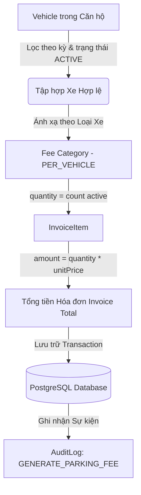

# Tài liệu Kỹ thuật: Tích hợp Quản lý Phương tiện vào Hệ thống Lập Hóa đơn (Billing - Vehicle Integration)

## 1. Tổng quan Kiến trúc

Tài liệu này mô tả chi tiết giải pháp tích hợp giữa module **Vehicle & Parking Management** và **Billing / Invoice Generation Engine** trong Hệ thống Quản lý Chung cư Thông minh (Smart Apartment Management System).

Mục tiêu cốt lõi của phase này là **LOẠI BỎ HOÀN TOÀN** logic hardcode số lượng xe (`quantity = 2`), chuyển đổi 100% sang cơ chế tính toán động, an toàn và chính xác theo thời gian thực dựa trên trạng thái hoạt động thực tế của phương tiện trong từng căn hộ.

---

## 2. Luồng Xử lý Dữ liệu Toàn trình (Data Flow Pipeline)



### Chi tiết từng giai đoạn:

```
Vehicle (ACTIVE, đúng kỳ, cư dân hợp lệ, thẻ chưa hết hạn)
  │
  ▼
FeeCategory (PARKING_MOTO / PARKING_CAR / PER_VEHICLE)
  │
  ▼
InvoiceItem (title, quantity, unitPrice, amount = qty * unitPrice, note)
  │
  ▼
Invoice Total (totalAmount = ∑ amounts)
```

---

## 3. Loại bỏ Hoàn toàn Logic Hardcode `quantity = 2`

### 3.1. Phân tích điểm lỗi trước đây
Trước đây trong `src/modules/invoice/invoice.service.ts`:
```typescript
// ❌ CODE CŨ (HARDCODE):
if (fee.unit === 'PER_M2') {
  quantity = apt.area;
} else if (fee.unit === 'PER_VEHICLE') {
  quantity = 2; // FIX CỨNG 2 XE CHO MỌI CĂN HỘ!
}
```
**Bất cập nghiêm trọng:**
- Căn hộ không có xe máy hoặc ô tô vẫn bị tính tiền 2 xe máy (200.000đ) và 2 ô tô (2.400.000đ).
- Căn hộ có 3 xe máy chỉ bị tính tiền 2 xe, gây thất thoát tài chính tòa nhà.
- Thiếu thông tin minh bạch về danh sách biển số xe được tính phí trên hóa đơn.

### 3.2. Giải pháp Động hóa Triệt để
Logic mới trong `InvoiceService`:
```typescript
// ✅ CODE MỚI (TỰ ĐỘNG ĐẾM PHƯƠNG TIỆN ACTIVE THEO LOẠI & KỲ THANH TOÁN):
} else if (fee.unit === 'PER_VEHICLE') {
  const matchingVehicles = getMatchingVehiclesForFee(activeVehicles, fee, feeCategories);
  quantity = matchingVehicles.length;

  // Quy tắc Zero-Quantity: Không tạo dòng phí nếu số lượng xe = 0
  if (quantity === 0) {
    continue;
  }

  const plates = matchingVehicles.map((v) => v.licensePlate).join(', ');
  note = `${quantity} phương tiện: ${plates}`;
}
```

---

## 4. Quy tắc Nghiệp vụ Tính Phí Gửi xe (Business Rules)

### 4.1. Điều kiện Xác định Phương tiện Hợp lệ trong Kỳ Billing (`billingMonth`)
Cho một căn hộ và kỳ thanh toán `billingMonth` (dạng `YYYY-MM`):
1. **Liên kết căn hộ**: `vehicle.apartmentId === apt.id`.
2. **Trạng thái phê duyệt**: Phương tiện bắt buộc phải có `status === VehicleStatus.ACTIVE`.
   - **Tuyệt đối không tính**: `PENDING_APPROVAL`, `REJECTED`, `INACTIVE`.
3. **Thời điểm đăng ký**: `vehicle.createdAt < endOfMonth` (phương tiện được đăng ký/phê duyệt trước hoặc trong kỳ thanh toán, không tính các xe phát sinh ở tháng tương lai).
4. **Trạng thái cư dân chủ xe**:
   - Nếu phương tiện gắn với cư dân (`residentId != null`), cư dân không được ở trạng thái `MOVED_OUT`.
5. **Thời hạn thẻ gửi xe (`ParkingCard`)**:
   - Nếu xe có thẻ gửi xe, thẻ không được hết hạn trước ngày đầu tiên của kỳ thanh toán (`expiresAt >= startOfMonth`).

### 4.2. Ánh xạ Danh mục phí (FeeCategory) sang Loại Xe (VehicleType)
Hệ thống sử dụng cơ chế so khớp thông minh:
- **`PARKING_MOTO`** hoặc tên chứa "xe máy" / "moto": Đếm các xe có type `MOTORBIKE` (và `ELECTRIC_BIKE` nếu chưa có biểu phí xe điện riêng).
- **`PARKING_CAR`** hoặc tên chứa "ô tô" / "xe hơi" / "car": Đếm các xe có type `CAR`.
- **`PARKING_BICYCLE`** hoặc tên chứa "xe đạp": Đếm các xe có type `BICYCLE`.
- **`PARKING_ELECTRIC_BIKE`** hoặc tên chứa "xe điện": Đếm các xe có type `ELECTRIC_BIKE`.
- **Biểu phí phương tiện chung**: Nếu mã và tên phí không chỉ định loại, đếm tất cả phương tiện active của căn hộ.

### 4.3. Quy tắc Không Tạo Dòng Phí Số Lượng 0 (Zero-Quantity Rule)
- Nếu căn hộ có 0 ô tô: **KHÔNG** tạo mục phí `PARKING_CAR` với số lượng 0 và tiền 0đ. Hóa đơn chỉ hiển thị các khoản phí thực tế phát sinh.

---

## 5. Đảm bảo Idempotency, Transaction & An toàn Máy chủ

### 5.1. Tính lũy thừa (Idempotency)
- Khi thực hiện `generateMonthlyInvoices`:
  Hệ thống kiểm tra `findByApartmentAndMonth(apt.id, billingMonth)`.
  Nếu đã tồn tại hóa đơn cho căn hộ trong tháng đó, hệ thống **bỏ qua** (`skippedCount++`), tuyệt đối không sinh trùng lặp hóa đơn.
- Khi tạo hóa đơn thủ công `createInvoice`: Kiểm tra ràng buộc duy nhất `(apartmentId, billingMonth)` và ném lỗi rõ ràng nếu trùng lặp.

### 5.2. Toàn vẹn Giao dịch (Database Transaction)
- Tất cả các thao tác sinh hóa đơn và tạo các dòng phí `InvoiceItem` được bọc trọn vẹn trong `prisma.$transaction`.
- Nếu có bất kỳ lỗi nào xảy ra trong quá trình xử lý của một hóa đơn hoặc toàn batch, toàn bộ thay đổi sẽ được rollback, đảm bảo tính nhất quán dữ liệu.

### 5.3. Tính toán Độc lập phía Backend (Zero-Trust Client)
- Máy chủ không tin tưởng các giá trị `quantity`, `unitPrice`, `amount`, `totalAmount` do frontend gửi lên trong API `POST /api/invoices`.
- Toàn bộ `unitPrice` được truy xuất trực tiếp từ bảng `FeeCategory`.
- Toàn bộ `quantity` cho các mục phí `PER_VEHICLE` được đếm trực tiếp từ danh sách xe `ACTIVE` trong database.
- Toàn bộ `amount = quantity * unitPrice` và `totalAmount = ∑ amount` được tính toán độc lập tại server.

### 5.4. Nhật ký Kiểm toán (Audit Logging)
- Hành động sinh hóa đơn hàng loạt ghi nhận action `GENERATE_MONTHLY_INVOICES`.
- Mỗi hóa đơn phát sinh phí gửi xe được ghi nhận action `GENERATE_PARKING_FEE` kèm chi tiết số lượng xe, danh sách biển số, đơn giá và tổng tiền trong trường `metadata`.

---

## 6. Giao diện Người dùng (Frontend UI)

### 6.1. Chi tiết Hóa đơn Quản trị (`/invoices` Drawer)
- Bảng danh sách mục phí hiển thị rõ ràng:
  - Tên khoản mục (kèm chú thích biển số xe cụ thể dưới tên phí).
  - Số lượng xe (`2`, `1`,...).
  - Đơn giá niêm yết.
  - Thành tiền tương ứng.

### 6.2. Cổng Cư dân (`/resident/invoices`)
- Thẻ hóa đơn hiển thị trực quan các dòng phí dạng:
  - `2 × Phí trông giữ xe máy: 200.000 đ`
  - `1 × Phí trông giữ ô tô: 1.200.000 đ`
- Cư dân dễ dàng đối soát số lượng phương tiện đang được tính phí của căn hộ mình.

---

## 7. Kết quả Kiểm thử Tự động (Automated Verification)

Hệ thống đã triển khai bộ test tự động tại `tests/billing-vehicle-integration.test.ts` bao gồm các kịch bản:

| STT | Kịch bản kiểm thử | Kết quả mong đợi | Trạng thái |
|---|---|---|---|
| 1 | Căn hộ có 0 xe | Phí gửi xe = 0 (không tạo item giữ xe) | ✅ ĐẠT |
| 2 | Căn hộ có 2 xe máy | Sinh 1 item `PARKING_MOTO`, quantity = 2, amount = 200.000 đ | ✅ ĐẠT |
| 3 | Căn hộ có 2 xe máy + 1 ô tô | Sinh 2 item: `PARKING_MOTO` (qty=2) & `PARKING_CAR` (qty=1) | ✅ ĐẠT |
| 4 | Xe `PENDING_APPROVAL` / `INACTIVE` / `REJECTED` | Không tính phí trong kỳ | ✅ ĐẠT |
| 5 | Xe tạo sau kỳ billing (tháng tương lai) | Không tính phí trong kỳ hiện tại | ✅ ĐẠT |
| 6 | Xe của cư dân đã `MOVED_OUT` | Không tính phí cho căn hộ | ✅ ĐẠT |
| 7 | Phát hành hóa đơn lần 2 cho cùng kỳ | Idempotency bảo vệ, 0 hóa đơn trùng lặp sinh ra | ✅ ĐẠT |
| 8 | Client gửi số lượng giả mạo `quantity: 999` | Server ghi đè bằng số lượng thực tế (2 xe), đơn giá chuẩn | ✅ ĐẠT |
| 9 | Ghi nhận Audit Log | Lưu đầy đủ sự kiện `GENERATE_PARKING_FEE` và metadata | ✅ ĐẠT |
