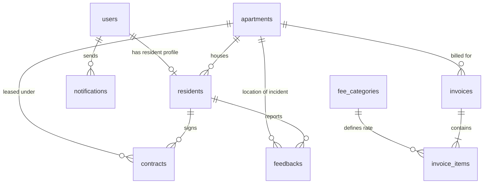

# Sơ đồ Cơ sở Dữ liệu (ERD) — Hệ thống Quản lý Chung cư Thông minh

## 1. Danh sách các Bảng & Mô tả

### 1.1 `users` (Tài khoản người dùng)
- **id**: String (Primary Key, CUID)
- **email**: String (Unique)
- **passwordHash**: String (bcrypt hash)
- **fullName**: String
- **phone**: String (Optional)
- **role**: Enum (`ADMIN`, `MANAGER`, `RESIDENT`)
- **isActive**: Boolean (Mặc định `true`)

### 1.2 `apartments` (Căn hộ)
- **id**: String (PK)
- **code**: String (Unique, e.g. "A-1001")
- **building**: String (Tòa A, Tòa B...)
- **floor**: Int (Tầng)
- **bedrooms**: Int
- **bathrooms**: Int
- **area**: Float (Diện tích m²)
- **status**: Enum (`VACANT`, `OCCUPIED`, `UNDER_MAINTENANCE`)

### 1.3 `residents` (Hồ sơ Cư dân)
- **id**: String (PK)
- **userId**: String (FK -> `users.id`, Optional)
- **apartmentId**: String (FK -> `apartments.id`, Optional)
- **fullName**: String
- **identityCard**: String (Unique, CCCD/CMND)
- **phone**: String
- **email**: String (Optional)
- **relationshipToOwner**: Enum (`OWNER`, `FAMILY`, `TENANT`)
- **status**: Enum (`RESIDING`, `MOVED_OUT`, `TEMPORARY_ABSENT`)

### 1.4 `contracts` (Hợp đồng)
- **id**: String (PK)
- **contractCode**: String (Unique)
- **apartmentId**: String (FK -> `apartments.id`)
- **residentId**: String (FK -> `residents.id`)
- **type**: Enum (`RENT`, `SALE`)
- **startDate**: DateTime
- **endDate**: DateTime
- **monthlyRent**: Float (Giá thuê/tháng)
- **deposit**: Float (Tiền cọc)
- **status**: Enum (`ACTIVE`, `EXPIRED`, `TERMINATED`)

### 1.5 `fee_categories` (Danh mục Phí dịch vụ)
- **id**: String (PK)
- **code**: String (Unique, e.g. `MGMT`, `PARKING_MOTO`, `ELECTRIC`, `WATER`)
- **name**: String
- **unit**: Enum (`PER_M2`, `PER_MONTH`, `PER_VEHICLE`, `PER_KWH`, `PER_M3`)
- **unitPrice**: Float (Đơn giá chuẩn)
- **isSystem**: Boolean

### 1.6 `invoices` & `invoice_items` (Hóa đơn & Chi tiết phí)
- **invoices**:
  - **id**: String (PK)
  - **code**: String (Unique)
  - **apartmentId**: String (FK -> `apartments.id`)
  - **billingMonth**: String ("YYYY-MM")
  - **dueDate**: DateTime
  - **totalAmount**: Float
  - **status**: Enum (`UNPAID`, `PAID`, `OVERDUE`, `CANCELLED`)
  - **paidAt**: DateTime (Optional)
  - **paymentMethod**: Enum (`VNPAY`, `MOMO`, `BANK_TRANSFER`, `CASH`)
- **invoice_items**:
  - **id**: String (PK)
  - **invoiceId**: String (FK -> `invoices.id`)
  - **feeCategoryId**: String (FK -> `fee_categories.id`)
  - **title**: String
  - **quantity**: Float
  - **unitPrice**: Float
  - **amount**: Float

### 1.7 `feedbacks` (Phản ánh & Báo sự cố)
- **id**: String (PK)
- **code**: String (Unique)
- **residentId**: String (FK -> `residents.id`)
- **apartmentId**: String (FK -> `apartments.id`)
- **category**: Enum (`ELECTRIC`, `WATER`, `ELEVATOR`, `SECURITY`, `CLEANLINESS`, `OTHER`)
- **title**: String
- **content**: String
- **priority**: Enum (`LOW`, `MEDIUM`, `HIGH`, `URGENT`)
- **status**: Enum (`NEW`, `PROCESSING`, `RESOLVED`, `REJECTED`)
- **responseContent**: String (Phản hồi của BQL)
- **rating**: Int (1 đến 5 sao)

### 1.8 `notifications` (Thông báo)
- **id**: String (PK)
- **title**: String
- **content**: String
- **isGlobal**: Boolean
- **senderId**: String (FK -> `users.id`)

---

## 2. Sơ đồ Quan hệ (Mermaid Diagram)

