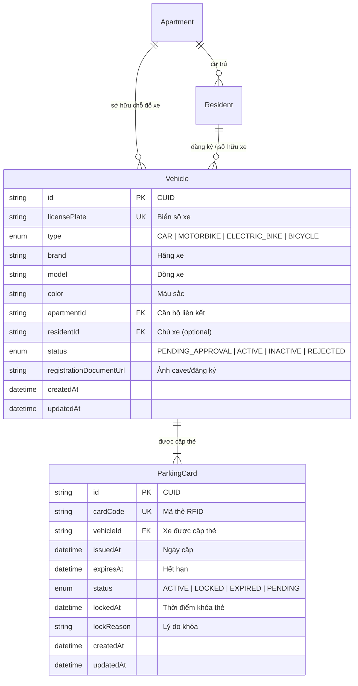

# Thiết Kế Cơ Sở Dữ Liệu: Phân Hệ Quản Lý Phương Tiện & Thẻ Gửi Xe (Vehicle & Parking Management)

> **Tài liệu**: Database Schema, ERD, Enums, Constraints & Migration  
> **Dự án**: Smart Apartment Management System  
> **Ngày thực hiện**: 11/09/2026  
> **Phiên bản Migration**: `20260911000000_add_vehicle_and_parking_management`

---

## 1. Sơ Đồ Thực Thể & Mối Quan Hệ (ER Relationship)

Phân hệ Quản lý Phương tiện & Thẻ Gửi xe được tổ chức theo cấu trúc phân cấp chặt chẽ:

```
┌──────────────┐
│  Apartment   │ (Căn hộ)
└──────┬───────┘
       │ 1
       │
       ├─────────────────────────────────┐
       │ 1..n                            │ 1..n
       ▼                                 ▼
┌──────────────┐                  ┌──────────────┐
│   Resident   │                  │   Vehicle    │ (Phương tiện gửi xe)
└──────┬───────┘                  └──────┬───────┘
       │ 0..1                            │ 1
       │ (Sở hữu)                        │
       └─────────────────────────────────┤
                                         │ 1..n (Lịch sử cấp thẻ)
                                         ▼
                                  ┌──────────────┐
                                  │ ParkingCard  │ (Thẻ từ RFID gửi xe)
                                  └──────────────┘
```

### Chi tiết quan hệ (Mermaid Diagram):



---

## 2. Chi Tiết Thực Thể (Entities)

### 2.1 Model `Vehicle` (`vehicles`)
Bản ghi đại diện cho một phương tiện giao thông đăng ký gửi tại tòa chung cư.

| Tên trường | Kiểu dữ liệu | Nullable | Mặc định | Ý nghĩa & Mô tả |
|---|---|---|---|---|
| `id` | String | Không | `cuid()` | Khóa chính (Primary Key). |
| `licensePlate` | String | Không | | **Biển số xe** (VD: `30A-999.88`, `29-G1 888.66`), Unique. |
| `type` | `VehicleType` | Không | `MOTORBIKE` | Loại phương tiện (Ô tô, Xe máy, Xe đạp điện, Xe đạp). |
| `brand` | String | Không | | Hãng sản xuất (VD: `Mercedes-Benz`, `Honda`, `Toyota`, `VinFast`). |
| `model` | String | Có | `null` | Dòng xe / Phiên bản (VD: `C200 Exclusive`, `SH 150i`, `VF8 Plus`). |
| `color` | String | Có | `null` | Màu sơn phương tiện (VD: `Trắng`, `Đen nhám`, `Đỏ pha lê`). |
| `apartmentId` | String | Không | | Khóa ngoại trỏ đến `Apartment.id`. Bắt buộc phương tiện phải gắn với 1 căn hộ. |
| `residentId` | String | Có | `null` | Khóa ngoại trỏ đến `Resident.id`. Đại diện cư dân đứng tên đăng ký xe. |
| `status` | `VehicleStatus` | Không | `PENDING_APPROVAL` | Trạng thái vòng đời của phương tiện. |
| `registrationDocumentUrl`| String | Có | `null` | URL hình ảnh Giấy đăng ký xe (Cavet) đối soát. |
| `createdAt` | DateTime | Không | `now()` | Thời điểm tạo hồ sơ xe. |
| `updatedAt` | DateTime | Không | `@updatedAt` | Thời điểm cập nhật hồ sơ gần nhất. |

### 2.2 Model `ParkingCard` (`parking_cards`)
Bản ghi đại diện cho thẻ vật lý (thẻ từ / RFID) cấp cho phương tiện để quẹt ra vào barie và bãi đỗ xe tầng hầm.

| Tên trường | Kiểu dữ liệu | Nullable | Mặc định | Ý nghĩa & Mô tả |
|---|---|---|---|---|
| `id` | String | Không | `cuid()` | Khóa chính (Primary Key). |
| `cardCode` | String | Không | | **Mã thẻ từ RFID** (VD: `CARD-CAR-001`, `CARD-MOTO-004`), Unique. |
| `vehicleId` | String | Không | | Khóa ngoại trỏ đến `Vehicle.id`. |
| `issuedAt` | DateTime | Có | `null` | Thời điểm Ban Quản Lý bàn giao và kích hoạt thẻ. |
| `expiresAt` | DateTime | Có | `null` | Thời điểm hết hạn hiệu lực thẻ (thường theo hạn hợp đồng hoặc định kỳ 1 năm). |
| `status` | `ParkingCardStatus` | Không | `PENDING` | Trạng thái hoạt động của thẻ. |
| `lockedAt` | DateTime | Có | `null` | Thời điểm thẻ bị khóa từ chối quẹt barie. |
| `lockReason` | String | Có | `null` | Lý do thẻ bị khóa (VD: *Cư dân báo mất thẻ*, *Căn hộ nợ tiền gửi xe*, *Chuyển đi*). |
| `createdAt` | DateTime | Không | `now()` | Thời điểm tạo mã thẻ trên hệ thống. |
| `updatedAt` | DateTime | Không | `@updatedAt` | Thời điểm cập nhật thẻ gần nhất. |

---

## 3. Các Danh Mục Giá Trị (Enums)

### 3.1 `VehicleType`
Phân loại phương tiện để áp dụng mức phí gửi xe tương ứng trong Danh mục Phí (`fee_categories`):
- `CAR`: Ô tô (áp dụng đơn giá `PARKING_CAR`, VD: 1.200.000đ/tháng).
- `MOTORBIKE`: Xe máy xăng thông thường (áp dụng đơn giá `PARKING_MOTO`, VD: 100.000đ/tháng).
- `ELECTRIC_BIKE`: Xe máy điện / Xe đạp điện (tính theo biểu phí xe máy hoặc xe điện có sạc).
- `BICYCLE`: Xe đạp cơ học (phí gửi xe đạp tiêu chuẩn).

### 3.2 `VehicleStatus`
Vòng đời quản lý phương tiện từ khi đăng ký đến khi xuất bãi:
- `PENDING_APPROVAL`: Cư dân nộp đơn đăng ký mới trực tuyến, đang chờ Ban Quản Lý kiểm tra giấy tờ.
- `ACTIVE`: Hồ sơ đã duyệt, xe được phép gửi trong bãi đỗ của tòa nhà và tính phí hàng tháng.
- `INACTIVE`: Phương tiện tạm ngừng gửi xe (chủ xe đi công tác dài ngày hoặc đã bán xe).
- `REJECTED`: Đơn đăng ký bị từ chối (do tầng hầm hết chỗ đỗ ô tô, hoặc giấy tờ không hợp lệ).

### 3.3 `ParkingCardStatus`
Trạng thái thẻ từ kiểm soát barie ra vào:
- `PENDING`: Thẻ mới tạo trên hệ thống, chưa bàn giao cho cư dân.
- `ACTIVE`: Thẻ đang có hiệu lực quẹt thẻ qua cổng barie.
- `LOCKED`: Thẻ bị khóa tạm thời hoặc vĩnh viễn (báo mất thẻ, nợ phí).
- `EXPIRED`: Thẻ đã quá ngày hết hạn `expiresAt`, cần gia hạn.

---

## 4. Ràng Buộc & Toàn Vẹn Dữ Liệu (Constraints & Indexes)

### 4.1 Ràng buộc Khóa & Duy nhất (Unique Constraints):
1. `vehicles.licensePlate`: `@unique` — Không cho phép 2 phương tiện trong toàn hệ thống trùng biển số.
2. `parking_cards.cardCode`: `@unique` — Mỗi thẻ từ vật lý chỉ có một mã định danh duy nhất.

### 4.2 Hành vi Xóa Dữ Liệu (ON DELETE Behavior):
1. **`Apartment` → `Vehicle` (`onDelete: Cascade`)**:
   Khi một căn hộ bị xóa khỏi hệ thống, toàn bộ phương tiện thuộc căn hộ đó sẽ bị xóa theo.
2. **`Resident` → `Vehicle` (`onDelete: SetNull`)**:
   **Bảo vệ dữ liệu lịch sử**: Khi một hồ sơ cư dân bị xóa (hoặc chuyển đi), phương tiện **KHÔNG BỊ XÓA** mà chỉ set `residentId = null`. Xe vẫn thuộc căn hộ và bãi đỗ tòa nhà, tránh mất dấu lịch sử xe.
3. **`Vehicle` → `ParkingCard` (`onDelete: Cascade`)**:
   Khi một phương tiện bị xóa, các thẻ gửi xe liên kết với xe đó sẽ bị dọn dẹp tương ứng.

### 4.3 Chỉ mục Tối ưu Hiệu năng (Database Indexes):
- `vehicles`:
  - `@@index([apartmentId])`: Tối ưu truy vấn danh sách xe của 1 căn hộ (phục vụ tính phí hóa đơn & dashboard cư dân).
  - `@@index([residentId])`: Tối ưu truy vấn phương tiện theo chủ xe.
  - `@@index([status])`: Tối ưu lọc phương tiện theo trạng thái (`ACTIVE`, `PENDING_APPROVAL`...).
  - `@@index([type])`: Tối ưu gom nhóm đếm số lượng ô tô, xe máy trong bãi.
- `parking_cards`:
  - `@@index([vehicleId])`: Tối ưu tìm thẻ theo xe.
  - `@@index([status])`: Tối ưu tìm kiếm các thẻ đang bị khóa hoặc hết hạn.

---

## 5. Quy Tắc Nghiệp Vụ (Business Rules)

1. **Quy tắc Sở hữu & Thuộc tính Căn hộ**:
   - Mọi phương tiện bắt buộc phải thuộc về một Căn hộ cụ thể (`apartmentId` NOT NULL).
   - Cư dân đứng tên chủ phương tiện (`residentId`) phải là người đang cư trú hoặc có liên kết với căn hộ đó.
2. **Quy tắc Cấp thẻ & Lịch sử thẻ**:
   - Một phương tiện chỉ được phép có **tối đa 1 thẻ từ ở trạng thái `ACTIVE`** tại cùng một thời điểm.
   - Khi cư dân báo mất thẻ, thẻ cũ chuyển sang trạng thái `LOCKED` (kèm `lockedAt` và `lockReason = "Báo mất thẻ"`). Thẻ mới được tạo thêm cho cùng chiếc xe đó với trạng thái `ACTIVE` (ví dụ: `CARD-MOTO-004-OLD` -> `CARD-MOTO-004`).
3. **Quy tắc Tính phí Hóa đơn Hàng tháng**:
   - Chỉ các phương tiện có `status = 'ACTIVE'` mới được đưa vào danh sách tính phí gửi xe trong kỳ hóa đơn.
   - Các xe ở trạng thái `PENDING_APPROVAL`, `INACTIVE`, hoặc `REJECTED` sẽ **không bị tính phí**.

---

## 6. Lịch Sử Migration & Dữ Liệu Mẫu

### 6.1 Các bước Migration đã thực thi:
1. **Baseline**: Đã tạo migration gốc `0_init` từ database hiện hữu và đánh dấu `prisma migrate resolve --applied 0_init`.
2. **Schema Migration**: Đã sinh và áp dụng migration:
   ```
   migrations/20260911000000_add_vehicle_and_parking_management/migration.sql
   ```
   thông qua lệnh `npx prisma migrate deploy` an toàn, bảo toàn 100% dữ liệu có sẵn.
3. **Prisma Client**: Đã biên dịch lại client qua `npx prisma generate`.

### 6.2 Dữ liệu Mẫu (Seeded Data):
Đã seed thành công **18 phương tiện** và **18 thẻ xe** đại diện:
- **Căn hộ A-1001**: 1 Ô tô Mercedes C200 (`30A-999.88`, thẻ `CARD-CAR-001`), 1 Xe máy SH (`29-G1 888.66`, thẻ `CARD-MOTO-001`), 1 Xe máy điện Klara S (`29-H2 334.55`, thẻ `CARD-EBIKE-001`), 1 Xe đạp Giant (`29-AA 019.88`, thẻ `CARD-BIKE-001`).
- **Căn hộ A-1002**: 1 Ô tô Camry (`30H-123.45`), 1 Xe máy Air Blade (`29-E1 678.90`).
- **Căn hộ B-2001**: 1 Ô tô Mazda CX-5 (`51H-555.22`), 1 Xe máy Vespa (`59-B1 777.88` có lịch sử đổi thẻ: thẻ cũ `LOCKED` do báo mất, thẻ mới `ACTIVE`).
- **Căn hộ B-2002**: 1 Xe máy Wave (`29-D2 456.12`), 1 Ô tô Tucson (`30F-889.90` trạng thái `INACTIVE`, thẻ `LOCKED` do bán xe).
- **Căn hộ C-0501**: 1 Xe máy Lead (`29-K1 223.34`), 1 Ô tô Ford Everest (`30G-332.11`, thẻ `EXPIRED`).
- **Xe chờ duyệt**: `30L-678.99` (VF9) và `29-X5 112.23` (Vision) trạng thái `PENDING_APPROVAL`.
- **Xe bị từ chối**: `30E-999.00` (Carnival) trạng thái `REJECTED`.
